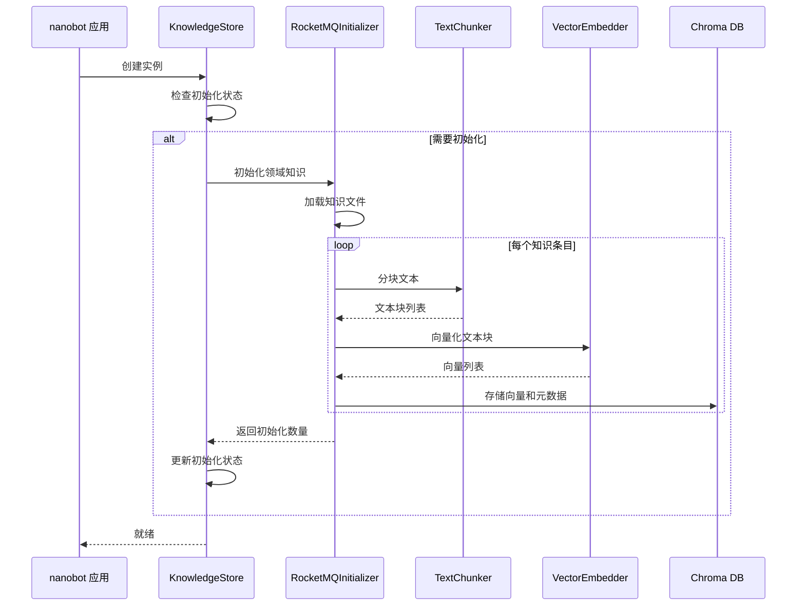

# 设计文档

## 概述

本设计文档描述了将 nanobot 知识库系统从基于 JSON 文件的存储改造为基于 Chroma 向量数据库的 RAG（检索增强生成）系统的技术方案。该系统将使用本地 Embedding 模型进行文本向量化，支持语义检索、自动初始化和增量更新。

### 设计目标

1. **语义检索**: 使用向量相似度搜索替代传统的关键词匹配，提高检索准确性
2. **自动化**: 在系统启动时自动初始化知识库，无需手动干预
3. **增量更新**: 支持动态添加、更新和删除知识条目
4. **API 兼容**: 保持现有 API 接口不变，最小化代码变更
5. **性能优化**: 使用批量处理和缓存机制提高系统性能

### 技术栈

- **向量数据库**: Chroma (chromadb)
- **Embedding 模型**: sentence-transformers (本地模型)
- **文本分块**: LangChain RecursiveCharacterTextSplitter
- **编程语言**: Python 3.11+

## 架构

### 系统架构图


### 数据流

#### 初始化流程



#### 检索流程


#### 增量更新流程


## 组件和接口

### 1. VectorEmbedder (新增)

负责文本向量化，使用本地 sentence-transformers 模型。

```python
class VectorEmbedder:
    """文本向量化器，使用本地 Embedding 模型"""
    
    def __init__(self, model_name: str = "BAAI/bge-large-zh-v1.5"):
        """
        初始化向量化器
        
        Args:
            model_name: sentence-transformers 模型名称
        """
        self.model_name = model_name
        self.model = None
        self._load_model()
    
    def _load_model(self) -> None:
        """加载 Embedding 模型"""
        pass
    
    def embed_text(self, text: str) -> List[float]:
        """
        向量化单个文本
        
        Args:
            text: 输入文本
            
        Returns:
            文本向量
        """
        pass
    
    def embed_batch(self, texts: List[str]) -> List[List[float]]:
        """
        批量向量化文本
        
        Args:
            texts: 文本列表
            
        Returns:
            向量列表
        """
        pass
```

### 2. TextChunker (新增)

负责将长文本分割为语义块。

```python
class TextChunker:
    """文本分块器"""
    
    def __init__(self, chunk_size: int = 1000, chunk_overlap: int = 200):
        """
        初始化分块器
        
        Args:
            chunk_size: 块大小（字符数）
            chunk_overlap: 块重叠大小（字符数）
        """
        self.chunk_size = chunk_size
        self.chunk_overlap = chunk_overlap
        self.splitter = None
        self._init_splitter()
    
    def _init_splitter(self) -> None:
        """初始化文本分割器"""
        pass
    
    def chunk_text(self, text: str, metadata: Dict[str, Any]) -> List[Dict[str, Any]]:
        """
        分块文本并保留元数据
        
        Args:
            text: 输入文本
            metadata: 元数据（id, domain, category, title, tags 等）
            
        Returns:
            分块结果列表，每个元素包含 text 和 metadata
        """
        pass
```

### 3. ChromaKnowledgeStore (重构)

重构后的 KnowledgeStore，集成 Chroma 向量数据库。

```python
class ChromaKnowledgeStore:
    """基于 Chroma 的知识库存储系统"""
    
    def __init__(self, workspace: Path, config: Optional[RAGConfig] = None):
        """
        初始化知识库
        
        Args:
            workspace: 工作空间路径
            config: RAG 配置
        """
        self.workspace = workspace
        self.config = config or RAGConfig()
        self.knowledge_dir = ensure_dir(workspace / "knowledge")
        self.chroma_dir = ensure_dir(self.knowledge_dir / "chroma_db")
        self.init_status_file = self.knowledge_dir / "init_status.json"
        
        # 初始化组件
        self.embedder = VectorEmbedder(self.config.embedding_model)
        self.chunker = TextChunker(
            chunk_size=self.config.chunk_size,
            chunk_overlap=self.config.chunk_overlap
        )
        self.chroma_client = None
        self._init_chroma()
        self._init_status: Dict[str, Any] = {}
        self._load_init_status()
        
        # 自动初始化内置知识
        self._auto_initialize_builtin_knowledge()
    
    def _init_chroma(self) -> None:
        """初始化 Chroma 客户端"""
        pass
    
    def _get_or_create_collection(self, domain: str) -> Any:
        """获取或创建 Chroma 集合"""
        pass
    
    def add_knowledge(
        self, 
        domain: str, 
        category: str, 
        title: str, 
        content: str,
        tags: List[str] = None, 
        source: str = "user", 
        priority: int = 1
    ) -> str:
        """
        添加知识条目
        
        Args:
            domain: 领域
            category: 分类
            title: 标题
            content: 内容
            tags: 标签列表
            source: 来源
            priority: 优先级
            
        Returns:
            知识条目 ID
        """
        pass
    
    def search_knowledge(
        self, 
        query: str = None, 
        domain: str = None,
        category: str = None, 
        tags: List[str] = None,
        top_k: int = None
    ) -> List[KnowledgeItem]:
        """
        搜索知识条目
        
        Args:
            query: 查询文本（用于语义检索）
            domain: 领域过滤
            category: 分类过滤
            tags: 标签过滤
            top_k: 返回结果数量
            
        Returns:
            知识条目列表
        """
        pass
    
    def update_knowledge(self, item_id: str, **kwargs) -> bool:
        """更新知识条目"""
        pass
    
    def delete_knowledge(self, item_id: str) -> bool:
        """删除知识条目"""
        pass
    
    def get_domains(self) -> List[str]:
        """获取所有领域列表"""
        pass
    
    def get_categories(self, domain: str = None) -> List[str]:
        """获取分类列表"""
        pass
    
    def get_tags(self, domain: str = None) -> List[str]:
        """获取标签列表"""
        pass
```

### 4. RAGConfig (新增)

RAG 系统配置类。

```python
@dataclass
class RAGConfig:
    """RAG 系统配置"""
    
    # Embedding 模型配置
    embedding_model: str = "BAAI/bge-large-zh-v1.5"
    
    # 文本分块配置
    chunk_size: int = 1000
    chunk_overlap: int = 200
    
    # 检索配置
    top_k: int = 5
    similarity_threshold: float = 0.0
    
    # 性能配置
    batch_size: int = 32
    timeout: int = 5
    
    @classmethod
    def from_env(cls) -> "RAGConfig":
        """从环境变量加载配置"""
        pass
```

### 5. KnowledgeItem (保持不变)

知识条目数据结构保持不变，确保 API 兼容性。

```python
@dataclass
class KnowledgeItem:
    """知识条目数据结构"""
    id: str
    domain: str
    category: str
    title: str
    content: str
    tags: List[str]
    created_at: str
    updated_at: str
    source: str = "user"
    priority: int = 1
    
    # 新增字段（可选）
    chunk_index: Optional[int] = None  # 分块索引
    similarity_score: Optional[float] = None  # 相似度分数
```

## 数据模型

### Chroma 集合结构

每个领域（domain）对应一个 Chroma 集合，集合结构如下：

```python
{
    "collection_name": "knowledge_{domain}",  # 例如: knowledge_rocketmq
    "embedding_function": VectorEmbedder,
    "metadata": {
        "domain": str,
        "version": str,
        "created_at": str
    }
}
```

### 文档存储格式

每个文本块在 Chroma 中存储为一个文档：

```python
{
    "id": "{item_id}_chunk_{index}",  # 例如: rocketmq_20240101120000_chunk_0
    "document": str,  # 文本块内容
    "embedding": List[float],  # 向量
    "metadata": {
        "item_id": str,  # 原始知识条目 ID
        "domain": str,
        "category": str,
        "title": str,
        "tags": List[str],
        "source": str,
        "priority": int,
        "created_at": str,
        "updated_at": str,
        "chunk_index": int,  # 分块索引
        "total_chunks": int  # 总分块数
    }
}
```

### 初始化状态格式

```python
{
    "rocketmq": {
        "version": "1.0.0",
        "initialized_at": "2024-01-01T12:00:00",
        "item_count": 150,
        "chunk_count": 450,
        "last_check": "2024-01-01T12:00:00"
    }
}
```

## 正确性属性

*属性是一个特征或行为，应该在系统的所有有效执行中保持为真——本质上是关于系统应该做什么的正式陈述。属性作为人类可读规范和机器可验证正确性保证之间的桥梁。*


### 属性 1: 领域集合隔离

*对于任意*领域名称，当向该领域添加知识条目时，系统应该为该领域创建独立的 Chroma 集合，且该集合只包含该领域的知识。

**验证需求**: 需求 1.5

### 属性 2: 长文本自动分块

*对于任意*内容长度超过配置的分块大小的知识条目，系统应该将其分割为多个文本块，且每个块的大小不超过配置的分块大小。

**验证需求**: 需求 3.1

### 属性 3: 分块元数据完整性

*对于任意*被分块的知识条目，所有生成的文本块都应该保留原始知识条目的完整元数据（id、domain、category、title、tags、source、priority）。

**验证需求**: 需求 3.3

### 属性 4: 元数据过滤正确性

*对于任意*查询和元数据过滤条件（domain、category、tags），返回的所有检索结果都应该满足指定的过滤条件。

**验证需求**: 需求 4.4、4.5、4.6

### 属性 5: 检索结果排序

*对于任意*查询，返回的检索结果应该按相似度分数降序排列，即结果列表中任意相邻的两个元素，前一个的相似度分数应该大于或等于后一个。

**验证需求**: 需求 4.8

### 属性 6: 增量添加一致性

*对于任意*新添加的知识条目，添加操作完成后，使用该知识条目的标题或内容进行语义检索，应该能够在检索结果中找到该知识条目。

**验证需求**: 需求 5.1

### 属性 7: 增量更新一致性

*对于任意*已存在的知识条目，当更新其内容后，使用新内容进行语义检索应该能够找到该知识条目，且返回的内容应该是更新后的内容，而不是旧内容。

**验证需求**: 需求 5.2

### 属性 8: 增量删除一致性

*对于任意*已存在的知识条目，当删除该条目后，使用该条目的标题或内容进行检索，不应该在结果中找到该知识条目。

**验证需求**: 需求 5.3

## 错误处理

### 错误类型

1. **ChromaConnectionError**: Chroma 数据库连接失败
   - 原因: Chroma 服务不可用、网络问题、权限问题
   - 处理: 抛出异常，提示用户检查 Chroma 配置和服务状态
   - 恢复: 无自动恢复，需要用户修复配置

2. **EmbeddingModelError**: Embedding 模型加载或使用失败
   - 原因: 模型文件不存在、模型格式错误、内存不足
   - 处理: 抛出异常，提示用户检查模型配置和资源
   - 恢复: 无自动恢复，需要用户修复配置

3. **ChunkingError**: 文本分块失败
   - 原因: 文本格式异常、分块参数无效
   - 处理: 记录警告，跳过该条目，继续处理其他条目
   - 恢复: 自动跳过，不影响其他条目

4. **VectorizationError**: 单个条目向量化失败
   - 原因: 文本内容异常、模型调用失败
   - 处理: 记录警告，跳过该条目，继续处理其他条目
   - 恢复: 自动跳过，不影响其他条目

5. **ConfigurationError**: 配置参数无效
   - 原因: 配置文件格式错误、参数值超出范围
   - 处理: 使用默认值，记录警告
   - 恢复: 自动使用默认值

### 错误处理策略

```python
class RAGKnowledgeError(Exception):
    """RAG 知识库系统基础异常"""
    pass

class ChromaConnectionError(RAGKnowledgeError):
    """Chroma 连接错误"""
    def __init__(self, message: str):
        super().__init__(
            f"Chroma 数据库连接失败: {message}\n"
            f"请检查:\n"
            f"1. Chroma 服务是否正常运行\n"
            f"2. 数据库路径是否有读写权限\n"
            f"3. 磁盘空间是否充足"
        )

class EmbeddingModelError(RAGKnowledgeError):
    """Embedding 模型错误"""
    def __init__(self, model_name: str, message: str):
        super().__init__(
            f"Embedding 模型 '{model_name}' 加载失败: {message}\n"
            f"请检查:\n"
            f"1. 模型文件是否存在\n"
            f"2. 模型路径配置是否正确\n"
            f"3. 系统内存是否充足"
        )
```

### 日志记录

使用结构化日志记录所有关键操作：

```python
import logging
from datetime import datetime

logger = logging.getLogger("nanobot.knowledge.rag")

# 初始化日志
logger.info(
    "初始化 RAG 知识库",
    extra={
        "domain": domain,
        "version": version,
        "timestamp": datetime.now().isoformat()
    }
)

# 操作日志（包含耗时）
start_time = time.time()
# ... 执行操作 ...
elapsed = time.time() - start_time
logger.info(
    "知识检索完成",
    extra={
        "query": query,
        "result_count": len(results),
        "elapsed_ms": int(elapsed * 1000)
    }
)

# 错误日志
logger.error(
    "向量化失败",
    extra={
        "item_id": item_id,
        "error": str(e)
    },
    exc_info=True
)
```

## 测试策略

### 双重测试方法

本系统采用单元测试和基于属性的测试相结合的方法：

- **单元测试**: 验证特定示例、边缘情况和错误条件
- **基于属性的测试**: 验证跨所有输入的通用属性
- 两者互补，共同提供全面覆盖

### 单元测试

单元测试专注于：
- 特定示例（如初始化、添加知识、检索）
- 集成点（Chroma 集成、模型加载）
- 边缘情况（空查询、无结果、超长文本）
- 错误条件（连接失败、模型不可用）

示例单元测试：

```python
def test_initialize_chroma_creates_database():
    """测试初始化创建 Chroma 数据库"""
    workspace = Path("/tmp/test_workspace")
    store = ChromaKnowledgeStore(workspace)
    
    # 验证数据库目录存在
    assert (workspace / "knowledge" / "chroma_db").exists()
    
    # 验证可以连接
    assert store.chroma_client is not None

def test_add_knowledge_with_long_content():
    """测试添加长内容知识会自动分块"""
    store = ChromaKnowledgeStore(workspace)
    long_content = "A" * 2000  # 超过默认分块大小
    
    item_id = store.add_knowledge(
        domain="test",
        category="test",
        title="Long Content",
        content=long_content
    )
    
    # 验证知识被添加
    assert item_id is not None
    
    # 验证可以检索到
    results = store.search_knowledge(query="Long Content")
    assert len(results) > 0

def test_search_with_domain_filter():
    """测试按领域过滤检索"""
    store = ChromaKnowledgeStore(workspace)
    
    # 添加不同领域的知识
    store.add_knowledge(domain="rocketmq", category="test", 
                       title="RocketMQ Test", content="RocketMQ content")
    store.add_knowledge(domain="kubernetes", category="test",
                       title="K8s Test", content="Kubernetes content")
    
    # 按领域过滤
    results = store.search_knowledge(query="Test", domain="rocketmq")
    
    # 验证所有结果都属于指定领域
    assert all(r.domain == "rocketmq" for r in results)

def test_chroma_connection_failure():
    """测试 Chroma 连接失败时抛出异常"""
    # 使用无效路径
    with pytest.raises(ChromaConnectionError):
        store = ChromaKnowledgeStore(Path("/invalid/path"))

def test_embedding_model_not_found():
    """测试 Embedding 模型不存在时抛出异常"""
    config = RAGConfig(embedding_model="nonexistent-model")
    
    with pytest.raises(EmbeddingModelError):
        store = ChromaKnowledgeStore(workspace, config)
```

### 基于属性的测试

基于属性的测试验证通用属性，每个测试运行至少 100 次迭代。

使用 Hypothesis 库进行基于属性的测试：

```python
from hypothesis import given, strategies as st

@given(
    domain=st.text(min_size=1, max_size=50),
    content=st.text(min_size=1, max_size=5000)
)
def test_property_domain_collection_isolation(domain, content):
    """
    属性测试: 领域集合隔离
    Feature: rag-knowledge-base, Property 1: 领域集合隔离
    """
    store = ChromaKnowledgeStore(workspace)
    
    # 添加知识到指定领域
    item_id = store.add_knowledge(
        domain=domain,
        category="test",
        title="Test",
        content=content
    )
    
    # 验证集合存在
    collection = store._get_or_create_collection(domain)
    assert collection is not None
    
    # 验证该领域的检索只返回该领域的知识
    results = store.search_knowledge(query=content[:50], domain=domain)
    assert all(r.domain == domain for r in results)

@given(
    content=st.text(min_size=1500, max_size=5000)
)
def test_property_long_text_chunking(content):
    """
    属性测试: 长文本自动分块
    Feature: rag-knowledge-base, Property 2: 长文本自动分块
    """
    store = ChromaKnowledgeStore(workspace)
    chunk_size = store.config.chunk_size
    
    # 添加长文本知识
    item_id = store.add_knowledge(
        domain="test",
        category="test",
        title="Long Text",
        content=content
    )
    
    # 获取该知识的所有分块
    collection = store._get_or_create_collection("test")
    results = collection.get(where={"item_id": item_id})
    
    # 验证每个块的大小不超过配置的分块大小
    for doc in results["documents"]:
        assert len(doc) <= chunk_size * 1.1  # 允许 10% 的误差

@given(
    domain=st.text(min_size=1, max_size=50),
    category=st.text(min_size=1, max_size=50),
    title=st.text(min_size=1, max_size=100),
    content=st.text(min_size=100, max_size=2000),
    tags=st.lists(st.text(min_size=1, max_size=20), min_size=1, max_size=5)
)
def test_property_chunk_metadata_integrity(domain, category, title, content, tags):
    """
    属性测试: 分块元数据完整性
    Feature: rag-knowledge-base, Property 3: 分块元数据完整性
    """
    store = ChromaKnowledgeStore(workspace)
    
    # 添加知识
    item_id = store.add_knowledge(
        domain=domain,
        category=category,
        title=title,
        content=content,
        tags=tags
    )
    
    # 获取所有分块
    collection = store._get_or_create_collection(domain)
    results = collection.get(where={"item_id": item_id})
    
    # 验证每个分块都保留了完整的元数据
    for metadata in results["metadatas"]:
        assert metadata["item_id"] == item_id
        assert metadata["domain"] == domain
        assert metadata["category"] == category
        assert metadata["title"] == title
        assert set(metadata["tags"]) == set(tags)

@given(
    query=st.text(min_size=1, max_size=100),
    filter_domain=st.text(min_size=1, max_size=50),
    filter_category=st.text(min_size=1, max_size=50),
    filter_tags=st.lists(st.text(min_size=1, max_size=20), min_size=1, max_size=3)
)
def test_property_metadata_filtering(query, filter_domain, filter_category, filter_tags):
    """
    属性测试: 元数据过滤正确性
    Feature: rag-knowledge-base, Property 4: 元数据过滤正确性
    """
    store = ChromaKnowledgeStore(workspace)
    
    # 添加一些测试数据
    for i in range(5):
        store.add_knowledge(
            domain=filter_domain if i < 3 else "other",
            category=filter_category if i < 2 else "other",
            title=f"Test {i}",
            content=f"Content {i} {query}",
            tags=filter_tags if i < 1 else ["other"]
        )
    
    # 测试领域过滤
    results = store.search_knowledge(query=query, domain=filter_domain)
    assert all(r.domain == filter_domain for r in results)
    
    # 测试分类过滤
    results = store.search_knowledge(query=query, category=filter_category)
    assert all(r.category == filter_category for r in results)
    
    # 测试标签过滤
    results = store.search_knowledge(query=query, tags=filter_tags)
    assert all(any(tag in r.tags for tag in filter_tags) for r in results)

@given(
    query=st.text(min_size=1, max_size=100)
)
def test_property_result_ordering(query):
    """
    属性测试: 检索结果排序
    Feature: rag-knowledge-base, Property 5: 检索结果排序
    """
    store = ChromaKnowledgeStore(workspace)
    
    # 添加一些测试数据
    for i in range(10):
        store.add_knowledge(
            domain="test",
            category="test",
            title=f"Test {i}",
            content=f"Content {i} {query}"
        )
    
    # 执行检索
    results = store.search_knowledge(query=query)
    
    # 验证结果按相似度降序排列
    for i in range(len(results) - 1):
        assert results[i].similarity_score >= results[i + 1].similarity_score

@given(
    domain=st.text(min_size=1, max_size=50),
    title=st.text(min_size=1, max_size=100),
    content=st.text(min_size=10, max_size=1000)
)
def test_property_incremental_add_consistency(domain, title, content):
    """
    属性测试: 增量添加一致性
    Feature: rag-knowledge-base, Property 6: 增量添加一致性
    """
    store = ChromaKnowledgeStore(workspace)
    
    # 添加知识
    item_id = store.add_knowledge(
        domain=domain,
        category="test",
        title=title,
        content=content
    )
    
    # 使用标题检索
    results = store.search_knowledge(query=title, domain=domain)
    
    # 验证能够找到刚添加的知识
    assert any(r.id == item_id for r in results)

@given(
    domain=st.text(min_size=1, max_size=50),
    old_content=st.text(min_size=10, max_size=500),
    new_content=st.text(min_size=10, max_size=500)
)
def test_property_incremental_update_consistency(domain, old_content, new_content):
    """
    属性测试: 增量更新一致性
    Feature: rag-knowledge-base, Property 7: 增量更新一致性
    """
    store = ChromaKnowledgeStore(workspace)
    
    # 添加知识
    item_id = store.add_knowledge(
        domain=domain,
        category="test",
        title="Test",
        content=old_content
    )
    
    # 更新知识
    store.update_knowledge(item_id, content=new_content)
    
    # 使用新内容检索
    results = store.search_knowledge(query=new_content[:50], domain=domain)
    
    # 验证能够找到更新后的知识，且内容是新内容
    matching_results = [r for r in results if r.id == item_id]
    assert len(matching_results) > 0
    assert new_content in matching_results[0].content

@given(
    domain=st.text(min_size=1, max_size=50),
    title=st.text(min_size=1, max_size=100),
    content=st.text(min_size=10, max_size=1000)
)
def test_property_incremental_delete_consistency(domain, title, content):
    """
    属性测试: 增量删除一致性
    Feature: rag-knowledge-base, Property 8: 增量删除一致性
    """
    store = ChromaKnowledgeStore(workspace)
    
    # 添加知识
    item_id = store.add_knowledge(
        domain=domain,
        category="test",
        title=title,
        content=content
    )
    
    # 验证可以检索到
    results_before = store.search_knowledge(query=title, domain=domain)
    assert any(r.id == item_id for r in results_before)
    
    # 删除知识
    store.delete_knowledge(item_id)
    
    # 验证检索不到
    results_after = store.search_knowledge(query=title, domain=domain)
    assert not any(r.id == item_id for r in results_after)
```

### 测试配置

- 每个基于属性的测试运行至少 100 次迭代
- 使用 Hypothesis 的 `@given` 装饰器生成随机测试数据
- 每个测试都标记了对应的设计属性编号
- 测试标签格式: `Feature: rag-knowledge-base, Property {number}: {property_text}`

### 集成测试

验证完整的 RAG 工作流程：

```python
def test_end_to_end_rag_workflow():
    """端到端测试: 完整的 RAG 工作流程"""
    workspace = Path("/tmp/test_workspace")
    
    # 1. 初始化系统
    store = ChromaKnowledgeStore(workspace)
    
    # 2. 添加 RocketMQ 知识
    rocketmq_manager = DomainKnowledgeManager(store, "rocketmq")
    rocketmq_manager.add_troubleshooting_guide(
        title="消息发送失败排查",
        content="当消息发送失败时，首先检查网络连接...",
        tags=["发送", "故障排查"]
    )
    
    # 3. 语义检索
    results = store.search_knowledge(
        query="如何解决消息发送问题",
        domain="rocketmq"
    )
    
    # 4. 验证检索结果
    assert len(results) > 0
    assert "发送" in results[0].tags
    assert results[0].domain == "rocketmq"
    
    # 5. 更新知识
    item_id = results[0].id
    store.update_knowledge(
        item_id,
        content="更新后的故障排查指南..."
    )
    
    # 6. 验证更新生效
    updated_results = store.search_knowledge(
        query="故障排查指南",
        domain="rocketmq"
    )
    assert any(r.id == item_id and "更新后" in r.content for r in updated_results)
    
    # 7. 删除知识
    store.delete_knowledge(item_id)
    
    # 8. 验证删除生效
    final_results = store.search_knowledge(
        query="消息发送失败排查",
        domain="rocketmq"
    )
    assert not any(r.id == item_id for r in final_results)
```

### 性能测试

验证检索响应时间：

```python
import time

def test_search_performance():
    """性能测试: 检索响应时间"""
    store = ChromaKnowledgeStore(workspace)
    
    # 添加大量知识
    for i in range(1000):
        store.add_knowledge(
            domain="test",
            category="test",
            title=f"Test {i}",
            content=f"Content {i} " * 100
        )
    
    # 测试检索性能
    start_time = time.time()
    results = store.search_knowledge(query="Test content")
    elapsed = time.time() - start_time
    
    # 验证响应时间在合理范围内（< 1 秒）
    assert elapsed < 1.0
    assert len(results) > 0
```

## 实现注意事项

### 1. Chroma 持久化

```python
import chromadb
from chromadb.config import Settings

# 使用持久化客户端
self.chroma_client = chromadb.PersistentClient(
    path=str(self.chroma_dir),
    settings=Settings(
        anonymized_telemetry=False,
        allow_reset=True
    )
)
```

### 2. Embedding 模型选择

推荐使用支持中文的多语言模型：

- `BAAI/bge-large-zh-v1.5`: 轻量级，适合资源受限环境
- `paraphrase-multilingual-mpnet-base-v2`: 更高质量，需要更多资源
- `distiluse-base-multilingual-cased-v2`: 平衡性能和质量

```python
from sentence_transformers import SentenceTransformer

self.model = SentenceTransformer(self.model_name)
```

### 3. 文本分块策略

使用 LangChain 的 RecursiveCharacterTextSplitter：

```python
from langchain.text_splitter import RecursiveCharacterTextSplitter

self.splitter = RecursiveCharacterTextSplitter(
    chunk_size=self.chunk_size,
    chunk_overlap=self.chunk_overlap,
    separators=["\n\n", "\n", "。", "！", "？", "；", " ", ""],
    keep_separator=True
)
```

### 4. 批量处理优化

```python
def _batch_embed(self, texts: List[str]) -> List[List[float]]:
    """批量向量化以提高性能"""
    batch_size = self.config.batch_size
    embeddings = []
    
    for i in range(0, len(texts), batch_size):
        batch = texts[i:i + batch_size]
        batch_embeddings = self.embedder.embed_batch(batch)
        embeddings.extend(batch_embeddings)
    
    return embeddings
```

### 5. 元数据过滤

Chroma 支持元数据过滤：

```python
# 构建过滤条件
where_filter = {}
if domain:
    where_filter["domain"] = domain
if category:
    where_filter["category"] = category
if tags:
    where_filter["tags"] = {"$in": tags}

# 执行检索
results = collection.query(
    query_embeddings=[query_vector],
    n_results=top_k,
    where=where_filter if where_filter else None
)
```

### 6. 版本控制

```python
def _should_reinitialize(self, domain: str, new_version: str) -> bool:
    """判断是否需要重新初始化"""
    status = self._init_status.get(domain, {})
    current_version = status.get("version")
    
    if not current_version:
        return True
    
    if current_version != new_version:
        return True
    
    # 检查集合是否存在
    try:
        collection = self.chroma_client.get_collection(f"knowledge_{domain}")
        if collection.count() == 0:
            return True
    except:
        return True
    
    return False
```
